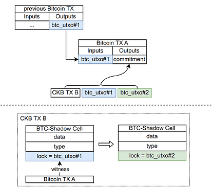

<!-- omit in toc -->
# Single-Use Seals

- [Introduction](#introduction)
- [Principle](#principle)

# Introduction

[RGB](https://rgb-org.github.io/) essentially brings smart contract ability to Bitcoin via client-side validation paradigm, the core idea is based on [Peter Todd's single-use-seal](https://petertodd.org/2017/scalable-single-use-seal-asset-transfer), which provides ability for any party having smart contract state history to verify its uniqueness. Client-side state transition assigns state to a set of defined single-use seals.

The fundamental primitives privided by the single-use seals are:

1. `Close(l, m) -> w`
   1. Close seal `l` over message `m`, producing a witness `w`
2. `Verify(l,w,m)→bool`
   1. Verify that the seal `l` was closed over message `m`, via `w`

Even though the idea is not too hard to understand, I didn't find a concrete example of the single-use seals, until recently.

Now let's dive into the details.

# Principle

(This picture is borrowed from [RGB++](https://mp.weixin.qq.com/s/iMQPXFPWBpT9dQLyR8rzUg), but the idea is the same, mainly differs from RGB in the vm part.)

As shown clearly in the above picture, the `btc_utxo#1` and `btc_utxo#2` are the single-use "seals"!

Here's the complete breakdown of terms:

1. seal `l` :=> `btc_utxo#1`/`btc_utxo#2`

2. message `m` :=> `CKB TX B`

3. witness `w` :=> `Bitcoin TX A`

4. `Close(l, m)` :=> Construct and send a `Bitcoin TX A` spending the previous seal `btc_utxo#1` that tiggers the state transition according to message `m`(`CKB TX B`), which assigns states to the new seal `btc_utxo#2`

5. `Verify(l,w,m)→bool` :=> Verify that the seal `l`(`btc_utxo#1`) was closed over message `m`(`CKB TX B`), via `w`(`Bitcoin TX A`)